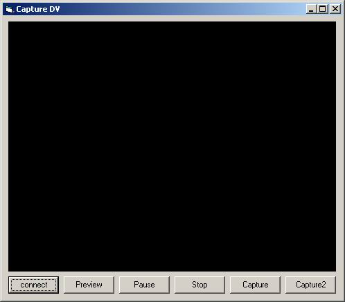



## Capture DV

### Description

you can capture Video from a Digital Video

camcorder through an IEEE 1394 bus with this

vb program.

DirectX 8.1 is needed

gpcapture.ocx(MFC ActiveX control,author: Genghis Khan)

http://www.itkhan.com/reference/gpcapture.ocx
 
### More Info
 

             |
---                |---
**Submitted On**   |2003-06-06 13:08:26
**By**             |[Genghis Khan](https://github.com/Planet-Source-Code/PSCIndex/blob/master/ByAuthor/genghis-khan.md)
**Level**          |Beginner
**User Rating**    |5.0 (10 globes from 2 users)
**Compatibility**  |VB 6\.0
**Category**       |[DirectX](https://github.com/Planet-Source-Code/PSCIndex/blob/master/ByCategory/directx__1-44.md)
**World**          |[Visual Basic](https://github.com/Planet-Source-Code/PSCIndex/blob/master/ByWorld/visual-basic.md)
**Archive File**   |[Capture\_DV159740662003\.zip](https://github.com/Planet-Source-Code/genghis-khan-capture-dv__1-45995/archive/master.zip)

